# NoteAI — Maestro E2E Tests

End-to-end UI automation for the [NoteAI](https://apps.apple.com/app/id6743739730) iOS app (`com.hubx.noteai`) using [Maestro](https://maestro.mobile.dev/).

---

## Test Coverage

The single flow (`e2e.yaml`) covers the full critical path:

1. **Launch** — App launch 
2. **Terms of Use** — Terms of Use screen
3. **Privacy Policy** — Privacy Policy screen
4. **Get Started** — Returns to onboarding entry screen
5. **Onboarding** — Full onboarding flow (Continue taps)
6. **Paywall** — 3-Day Free Trial screen & subscription flow
7. **Trial Activation** — Confirms trial activated successfully
8. **Home** — Home screen visible with Note AI branding
9. **Upload & Create Note** — Picks audio file from Files app, creates note
10. **Note Detail** — Opens note detail with Transcript / Note Tools
11. **Translate** — Translates note to Spanish via Note Tools
12. **Quiz** — Generates quiz from note, verifies first question

---
## Requirements

- **Maestro** 2.1.0+  
  ```bash
  curl -Ls "https://get.maestro.mobile.dev" | bash
  ```
- **iOS device** connected via USB (tested on iPhone 14 Pro, iOS 26.4.2)

---

## Setup

### 1. Find your device UDID

```bash
xcrun xctrace list devices
```

### 3. Install the app

Build and install `com.hubx.noteai` on your device via Xcode or `xcrun devicectl`.

---

## Running the Tests

```bash
MAESTRO_DRIVER_STARTUP_TIMEOUT=90000 maestro --udid <YOUR_DEVICE_UDID> test e2e.yaml
```

Screenshots are saved automatically to `./screenshots/`.

---

## Project Structure

```
.
├── e2e.yaml          # Main end-to-end flow
└── screenshots/      # Auto-generated test screenshots
```

---

## Screenshots

<table>
  <tr>
    <td align="center">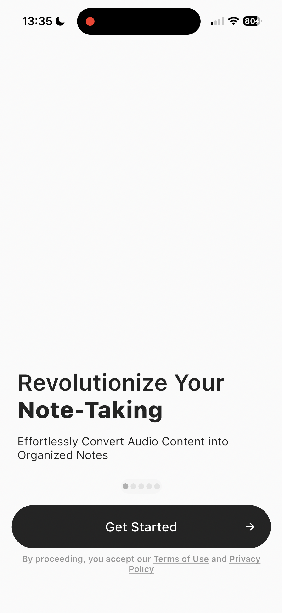<br/>App Launch</td>
    <td align="center">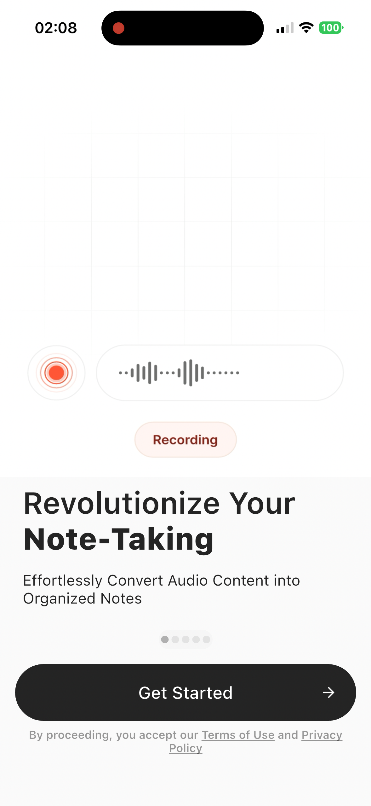<br/>Get Started</td>
    <td align="center">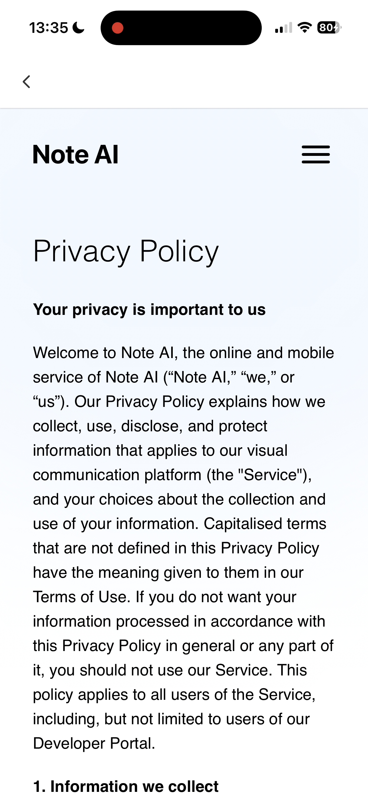<br/>Privacy Policy</td>
    <td align="center">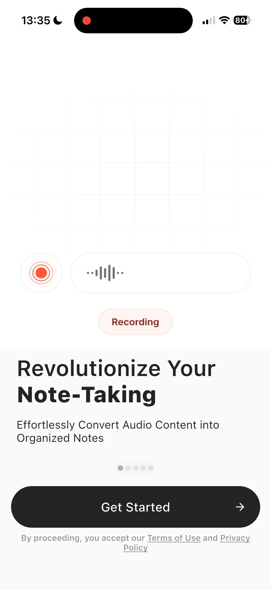<br/>Back on Get Started</td>
  </tr>
  <tr>
    <td align="center">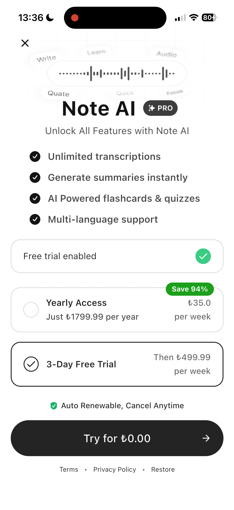<br/>Onboarding Done</td>
    <td align="center">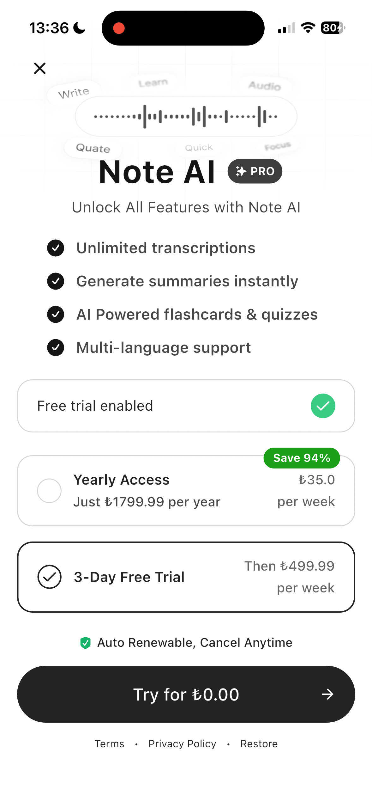<br/>Paywall</td>
    <td align="center">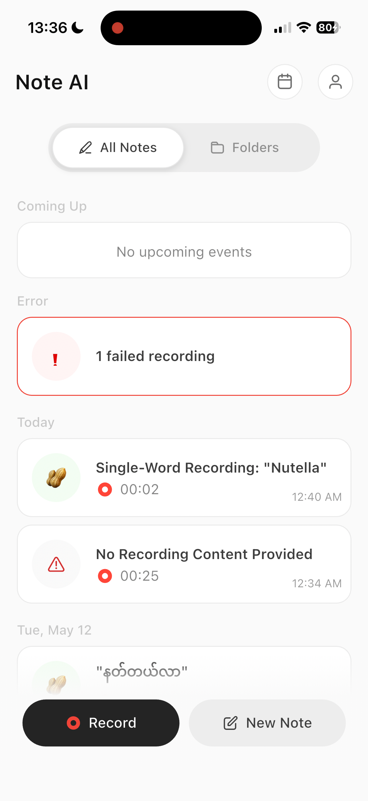<br/>Trial Activated</td>
    <td align="center"><br/>Home Screen</td>
  </tr>
  <tr>
    <td align="center">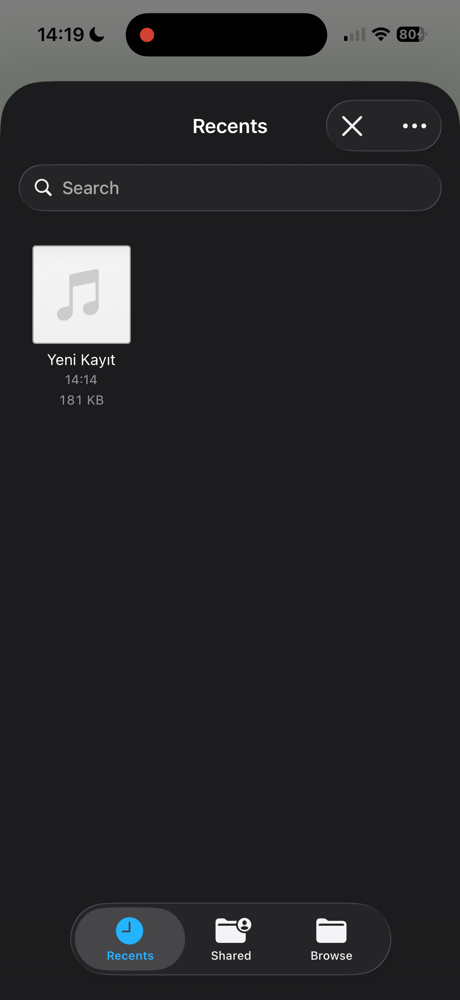<br/>File Picker</td>
    <td align="center">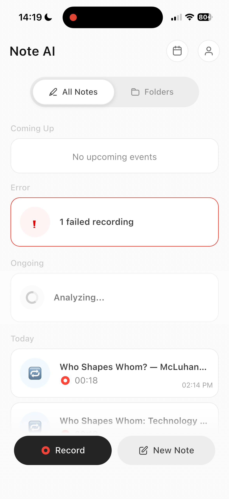<br/>Note Created</td>
    <td align="center">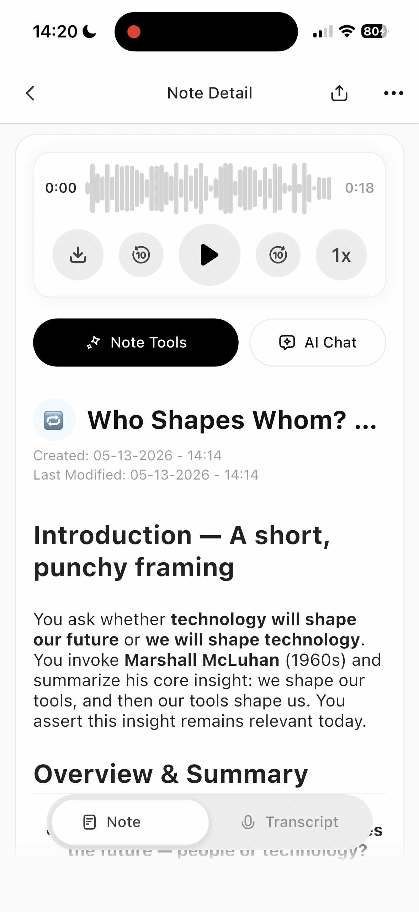<br/>Note Detail</td>
    <td align="center">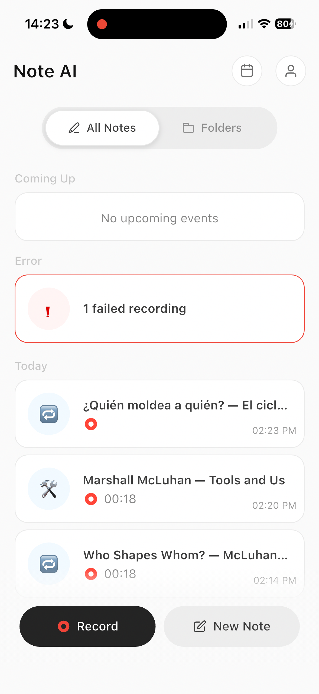<br/>Translation Done</td>
  </tr>
  <tr>
    <td align="center">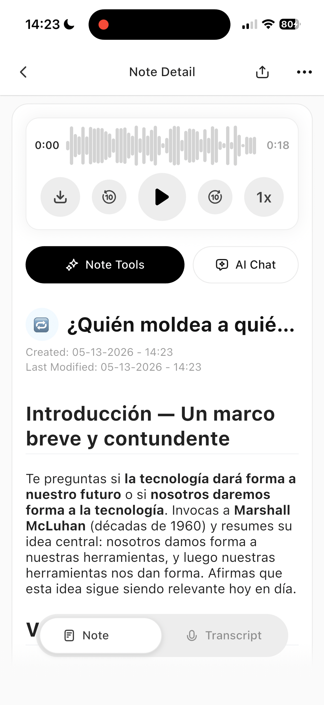<br/>Translated Note</td>
    <td align="center">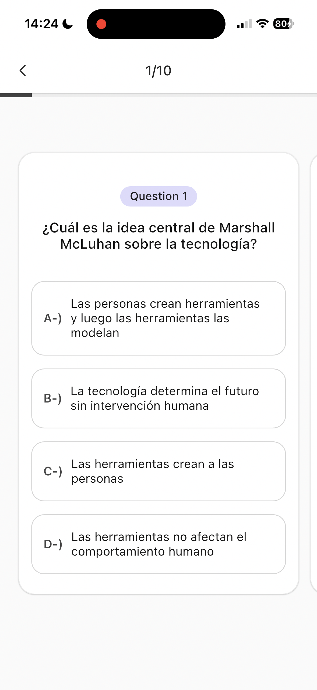<br/>Quiz Generated</td>
    <td align="center"><br/>Done</td>
    <td></td>
  </tr>
</table>

---

## Known Limitations

- **Coordinate-based taps:** NoteAI does not expose most UI elements to the accessibility tree, so several interactions rely on screen coordinates (`point: "x%, y%"`). These may break if the app layout changes.
- **Face ID / StoreKit:** The subscription step requires manual Face ID confirmation.
